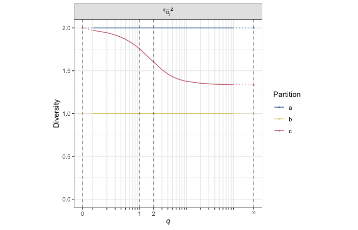
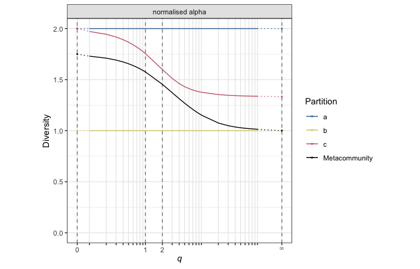
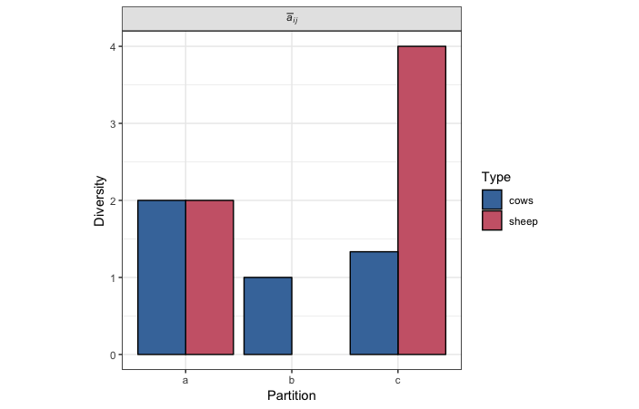

# rdiversity  
[](https://travis-ci.org/boydorr/rdiversity)
[](https://ci.appveyor.com/project/mysteryduck/rdiversity)
[](https://coveralls.io/github/boydorr/rdiversity?branch=master)
[](https://doi.org/10.5281/zenodo.597470)
[](http://cranlogs.r-pkg.org/badges/grand-total/rdiversity)


`rdiversity` is a package for R based around a framework for measuring biodiversity using similarity-sensitive diversity measures. It provides functionality for measuring alpha, beta and gamma diversity of metacommunities (e.g. ecosystems) and their constituent subcommunities, where similarity may be defined as taxonomic, phenotypic, genetic, phylogenetic, functional, and so on. It uses the diversity framework described in the arXiv paper [arXiv:1404.6520 (q-bio.QM)](https://arxiv.org/abs/1404.6520), *How to partition diversity*. 

This package has now reached a stable release and is cross-validated against our Julia package [Diversity.jl](https://github.com/richardreeve/Diversity.jl), which is developed independently. Please [raise an issue](https://github.com/boydorr/rdiversity/issues) if you find any problems.


## Contents

Getting started:

* [Installation](#installation)
* [Generating a metacommunity](#generating-a-metacommunity)
* [Calculating diversity](#calculating-diversity)
* [Plotting diversity](#plotting-diversity)

Special cases:

* [Taxonomic diversity](#taxonomic-diversity)
* [Phylogenetic diversity](#phylogenetic-diversity)

Miscellaneous:

* [Additional tools](#additional-tools)


## Installation

To install rdiversity from CRAN, simply run the following from an R console:

```{r}
install.packages("rdiversity")
```

## Generating a metacommunity

Before calculating diversity a `metacommunity` object must be created. This object contains all the information needed to calculate diversity. In the following example, we generate a metacommunity (`pop`) comprising three species ("cows" and "sheep"), and partitioned across three subcommunitites (a, b, and c).

```{r}
# Load the package into R
library(rdiversity)

# Example population
pop <- data.frame(a=c(1,1),b=c(2,0),c=c(3,1))
row.names(pop) <- c("cows", "sheep")
```
The `metacommunity()` function takes two arguments, `partition` and `similarity`. When species are considered completely distinct, an identity matrix is required, which is generated automatically if the `similarity` argument is missing.

```{r}
# Create metacommunity object
meta <- metacommunity(pop)
```
Each `metacommunity` object contains the following slots:

* `@type_abundance` : the abundance of types within a population,  
* `@similarity` : the pair-wise similarity of types within a population,  
* `@ordinariness` : the ordinariness of types within a population,  
* `@subcommunity_weights` :  the relative weights of subcommunities within a population, and
* `@type_weights` : the relative weights of types within a population.


## Calculating diversity
### Method 1
This method uses a wrapper function to simplify the pipeline and is recommended if only a few measures are being calculated.

A complete list of these functions is shown below:

* `raw_sub_alpha()` : estimate of naive-community metacommunity diversity  
* `norm_sub_alpha()` : similarity-sensitive diversity of subcommunity *j* in isolation  
* `raw_sub_rho()` : redundancy of subcommunity *j*  
* `norm_sub_rho()` : representativeness of subcommunity *j*  
* `raw_sub_beta()` : distinctiveness of subcommunity *j*  
* `norm_sub_beta()` : estimate of effective number of distinct subcommunities  
* `raw_sub_gamma()` : contribution per individual toward metacommunity diversity  
* `raw_meta_alpha()` : naive-community metacommunity diversity  
* `norm_meta_alpha()` : average similarity-sensitive diversity of subcommunities  
* `raw_meta_rho()` : average redundancy of subcommunities  
* `norm_meta_rho()` : average representativeness of subcommunities  
* `raw_meta_beta()` : average distinctiveness of subcommunities  
* `norm_meta_beta()` : effective number of distinct subcommunities  
* `meta_gamma()` : metacommunity similarity-sensitive diversity  

Each of these functions take two arguments, `meta` (a `metacommunity` object) and `qs` (a vector of q values), and output results as a `diversity` object. For example, to calculate normalised subcommunity alpha diversity for *q=0*, *q=1*, and *q=2*:

```{r}
norm_sub_alpha(meta, 0:2)
```

However, if multiple measures are required and computational efficiency is an issue, then the following method is recommended (the same results are obtained).


### Method 2
This method requires that we first calculate the species-level components, by passing a `metacommunity` object to the appropriate function; `raw_alpha()`, `norm_alpha()`, `raw_beta()`, `norm_beta()`, `raw_rho()`, `norm_rho()`, or `raw_gamma()`. Subcommunity- and metacommunity-level diversities are a kind of average (based on *q*) of these values, which are calculated using the functions `subdiv()` and `metadiv()`. Note that, since both subcommunity and metacommunity diversity measures are transformations of the same species-level component, this is computationally more efficient.

```{r}
# First, calculate the species-level component for normalised alpha
component <- norm_alpha(meta)

# Then, calculate normalised alpha at the subcommunity-level 
subdiv(component, 0:2)

# Likewise, calculate normalised alpha at the metacommunity-level 
metadiv(component, 0:2)
```

In some instances, it may be useful to calculate **all** subcommunity (or metacommunity) measures. In which case, a `metacommunity` object may be passed directly to `subdiv()` or `metadiv()`:

```{r}
# To calculate all subcommunity diversity measures
subdiv(meta, 0:2)

# To calculate all metacommunity diversity measures
metadiv(meta, 0:2)
```


## Plotting diversity

All of these results are output as `diversity` objects, which can be visualised using the `plot()` function. For example:

```{r}
component <- norm_alpha(meta)

# Normalised subcommunity alpha
sc <- subdiv(component, 0:10)
plot(sc)
```


```{r}
# Normalised metacommunity alpha
mc <- metadiv(component, 0:10)
plot(mc)
```



```{r}
# All subcommunity measures
all <- subdiv(meta, 0:10)
plot(all)
```



The function `diversity()` can be used to transform `data.frame` and `list` objects into `diversity` objects ready for plotting. This function is useful when generating plots containing both the subcommunity- and metacommunity-level diversities, or when only certain measures are of interest. For example:

```{r}
combine <- rbind.data.frame(sc, mc)
res1 <- diversity(combine)

# or...
combine <- list(sc, mc)
res1 <- diversity(combine)

plot(res1)
```


```{r}
alpha <- norm_sub_alpha(meta, 0:10)
rho <- norm_sub_rho(meta, 0:10)

res2 <- diversity(list(alpha, rho)) 

plot(res2)
```


If diversity is calculated for *q=Inf* is calculated, *q* is transformed on a log scale. For example:

```{r}
qs <- c(seq(0,1,.1),2:10, seq(20,100,10),Inf)
res3 <- norm_sub_alpha(meta, qs)

plot(res3)
```


Note that in the above example, *q=0*, *q=1*, *q=2*, and *q=Inf* are highlighted as important, corresponding to Species Richness, Shannon, Simpson, and Berger Parker diversity, respecively.

In some cases, it might also be useful to examine the species-level components, which is done in the following way:

```{r}
# Or we can look at the individual species-level components
ind <- inddiv(component, c(seq(0,1,.1),2:10, seq(20,100,10),Inf))

plot(ind)
```



Note that generally defined as **types** or any biologically meaningful unit)


## Taxonomic diversity

`tax2dist()`


```{r}

pop <- sample(1:50, 4)
lookup <- data.frame(Subclass=c("Sapindales", "Malvales", "Fabales", "Fabales"),      
Family=c("Burseraceae", "Bombacaceae", "Fabaceae", "Fabaceae"), 
Genus=c("Protium", "Quararibea", "Swartzia", "Swartzia"),       
Species= c("tenuifolium", "asterolepis","simplex var.grandiflora","simplex var.ochnacea"))
qs <- c(seq(0,1,.1),2:10, seq(20,100,10),Inf)

# Calculate distance matrix
dist <- tax2dist(pop, lookup)

# Calculate similarity matrix
similarity <- dist2sim(dist, "l")

# Generate metacommunity object
meta <- metacommunity(pop, similarity)
```


## Phylogenetic diversity
Phylogenetic diversity measures can be broadly split into two categories – those that look at the phylogeny as a whole, such as Faith’s (1992) phylogenetic diversity (Faith’s PD), and those that look at pairwise tip distances, such as mean pairwise distance (MPD; Webb, 2000). The framework of measures presented in this package is able to quantify phylogenetic diversity using both of these methods.


```{r}
# Example data
tree <- ape::rtree(4)
pop <- matrix(1:12, ncol=3)
pop <- pop/sum(pop)
```

### Distance-based phylogenetic diversity

1. Generate a distance matrix using the `phy2dist()` function to extract pairwise tip distances from a `phylo` object
```{r}
# Generate pairwise distance matrix
dist <- phy2dist(tree)
```
2. Generate a similarity matrix using the `dist2sim()` function to transform distances into similarities
```{r}
# Convert distances to similarities
similarity <- dist2sim(dist, "l")
```
Note that this transformation can be done in three different ways, by setting the `transform` argument as `l`, `e1`, or `e2`, respectively:


3. Generate a metacommunity object using the `metacommunity()` function
```{r}
# Generate metacommunity object
meta <- metacommunity(pop, similarity)
```
4. Calculate diversity


### Tree-based phylogenetic diversity
1. Ensure that tip labels match the partition matrix row names 
```{r}
# Tree 
colnames(pop) <- letters[1:3]
row.names(pop) <- paste0("sp",1:4)
tree$tip.label <- row.names(pop)
```
2. Generate a similarity object using the `phy2branch()` function
```{r}
# Generate similarity object
similarity <- phy2branch(tree)
```
3. Generate a metacommunity object using the `metacommunity()` function
```{r}
# Generate metacommunity object
meta <- metacommunity(pop, similarity)
```
4. Calculate diversity


**Note that**: a metcommunity that was generated using the tree-based approach will contain three additional slots:

* `@raw_abundance` : the relative abundance of terminal species (where types are then considered to be historical species),
* `@raw_structure` : the length of evolutionary history of each historical species
* `@parameters` : parameters associated with historical species


## Additional tools
* `qD_single()` : the Hill number / naive-type diversity of order *q* of a single population  
* `qD()` : the Hill number / naive-type diversity of a series of independent populations for a series of orders  
* `qDZ_single()` : the similarity-sensitive diversity of order *q* of a single population
* `qDZ()` : the similarity-sensitive diversity of a series of independent populations for a series of orders  
